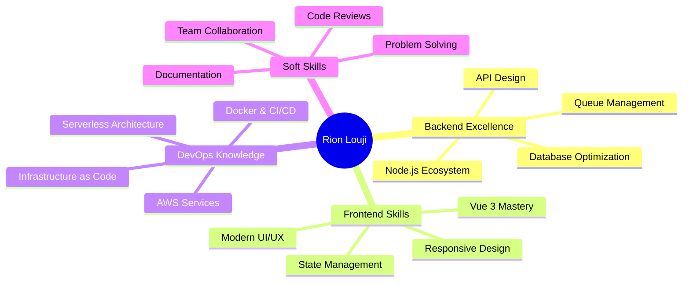

<div align="center">
  
</div>

<p align="center">
  
  
  
</p>

---

## 🚀 About Me

```javascript
const rionLouji = {
    title: "Software Engineer",
    location: "Building the Future 🌍",
    code: ["JavaScript", "Python", "Java"],
    passion: "Turning coffee into scalable systems ☕ → 🚀",
    
    expertise: {
        backend: ["Node.js", "Fastify", "Express", "Bull Queue"],
        frontend: ["Vue 3", "Vite", "Pinia", "Element Plus"],
        databases: ["PostgreSQL", "Redis", "MongoDB", "MySQL", "Sequelize ORM"],
        cloud: ["AWS S3", "IAM", "Docker", "Jenkins"],
        architecture: ["Microservices", "Event-Driven", "RESTful APIs", "Distributed Systems"],
        tools: ["Distributed Locking", "Rate Limiting", "JWT Auth", "i18n", "Axios"]
    },
    
    currentMission: "Architecting high-performance logistics solutions",
    learning: ["Advanced System Design", "Cloud Architecture", "Distributed Systems"],
    
    workingOn: "Enterprise logistics platforms at scale 📦",
    
    philosophy: "Clean code is not written by following rules. It's written by caring.",
    
    funFacts: [
        "Debug production faster than brewing coffee ⚡",
        "Can optimize queries in my sleep 😴",
        "Believe in code reviews > code cowboys 🤠"
    ],
    
    goals2026: ["Master Distributed Systems", "Contribute to OSS", "Build Something Amazing"],
    
    futureAmbition: "Building AI-powered medical systems for autonomous surgical assistance",
    interests: ["Healthcare Technology", "Medical Robotics", "AI in Surgery", "Life-saving Systems"],
    
    reachMe: "sjrion01@gmail.com"
};
```

<div align="center">

### 💡 What Drives Me

**Performance Optimization** • **Clean Architecture** • **Scalable Solutions** • **Distributed Systems** • **Team Collaboration**

### 🎯 Future Vision

**Passionate about leveraging technology for healthcare** — Building AI-powered systems for autonomous surgical assistance and medical robotics that can save lives without human intervention.

</div>

---

## 🛠️ Tech Stack

<div align="center">

| **Category** | **Technologies** |
| :--- | :--- |
| **Languages** |    |
| **Backend** |     |
| **Frontend** |     |
| **Database & ORM** |      |
| **DevOps & Cloud** |     |
| **Tools & Libraries** |     |

</div>

---

## 📊 GitHub Stats

<p align="center">
  
</p>

<p align="center">
  
</p>

<p align="center">
  
</p>

---

## 🏆 GitHub Trophies

<p align="center">
  
</p>

---

## 📈 Contribution Activity

<div align="center">
  
</div>

<details>
<summary>📅 View Detailed Contribution Stats</summary>
<br>
<div align="center">
  
  <br><br>
  
  
</div>
</details>

---

## 🎯 Current Focus

<div align="center">

| 🔨 Building | 📚 Learning | 🎓 Exploring |
|:---:|:---:|:---:|
| Enterprise Logistics Platform | System Design Patterns | Distributed Systems |
| High-Performance APIs | Cloud Architecture | Event-Driven Architecture |
| Scalable Microservices | Performance Optimization | Container Orchestration |

</div>

---

## 💼 What I Bring to the Table

<div align="center">



</div>

---

## 🌟 Featured Projects

<div align="center">

| Project | Description | Tech Stack |
|:---|:---|:---|
| 🚚 **Logistics Management Platform** | Enterprise solution for shipment tracking and management | Fastify, PostgreSQL, Redis, Bull, AWS |
| 🔄 **Real-time Queue System** | Event-driven background job processor | Bull, Redis, Node.js |
| 🎨 **Modern Dashboard** | Vue 3 admin panel with Vite | Vue 3, Vite, CSS3 |

</div>

---

## 💻 Recent Activity

<!--START_SECTION:activity-->
<!--END_SECTION:activity-->

---

## 📫 Let's Connect & Collaborate!

<div align="center">

### I'm always open to interesting conversations and collaboration opportunities!

<a href="https://www.linkedin.com/in/packmarrionlouji/" target="_blank">
  
</a>
<a href="mailto:sjrion01@gmail.com">
  
</a>
<a href="https://github.com/PackmarRionLouji">
  
</a>

### 💬 Ask me about: Node.js • Vue.js • System Design • Database Optimization • AWS

</div>

---

<div align="center">

### ⚡ "Code is like humor. When you have to explain it, it's bad." - Cory House


</div>
